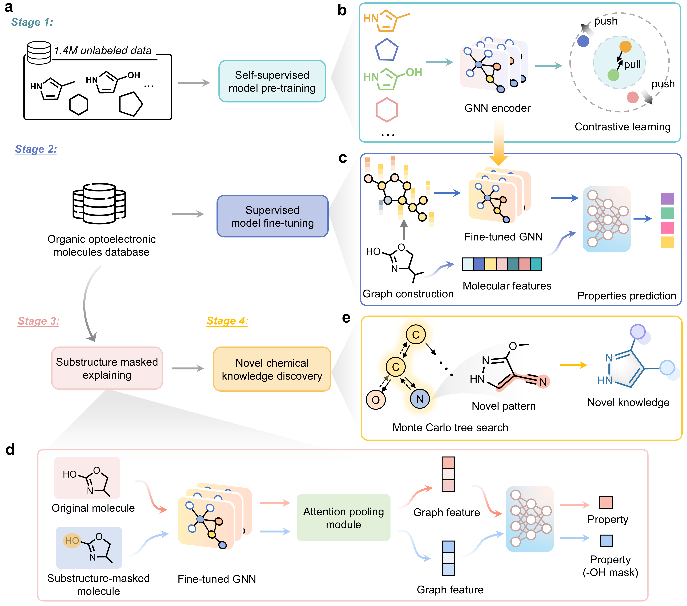
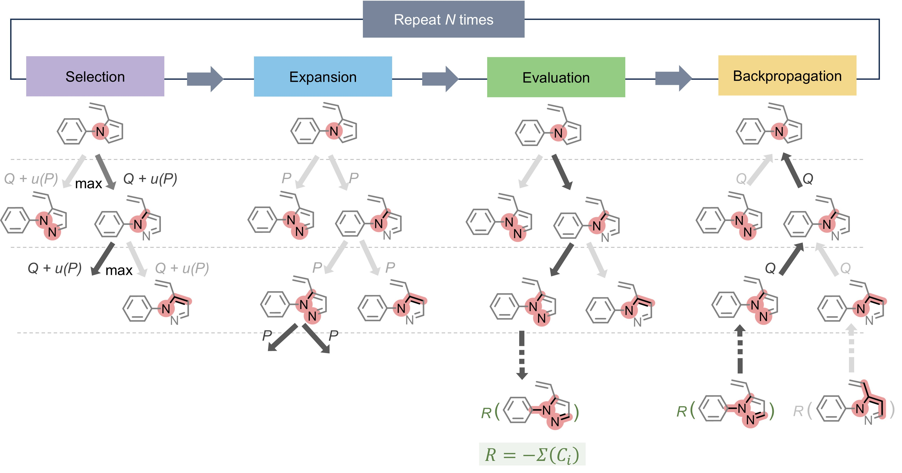

# LUMIA: Learning and Understanding Molecular Insights with AI
<div align="center">


[](https://github.com/YajingSun-Group/LUMIA/blob/main/LICENSE)

</div>

This is a repository for paper **"Discovering Molecular Insights into Organic Optoelectronics using Knowledge-Informed Deep Learning"**.

## Table of Contents
- [Introduction](#introduction)
- [Getting Started](#getting-started)
  - [Installation](#installation)
  - [Datasets and Pretrained Model Weights](#datasets-and-pretrained-model-weights)
- [Fine-tuning](#fine-tuning)
- [Pre-training](#pre-training)
- [Explainability](#explainability)
- [Monte Carlo Tree Search for Novel Knowledge Discovery](#monte-carlo-tree-search-for-novel-knowledge-discovery)
- [Jupyter Notebooks](#jupyter-notebooks)
- [Benchmark](#benchmark)
- [Acknowledgements](#acknowledgements)


## Introduction
LUMIA (Learning and Understanding Molecular Insights with AI) is a deep learning framework for discovering molecular insights in organic optoelectronic molecules. This framework is designed to be used for the novel knowledge discovery in organic functional molecules and has the following features:

🚀 Accurate prediction of organic optoelectronic properties\
🔍 Discover novel substructural patterns using explainable deep learning\
🧪 Give insights into the design of new organic optoelectronic molecules

An overview of LUMIA can be seen below:



## Getting Started

### Installation
Clone the github repo and set up conda environment

```bash
git clone https://github.com/YajingSun-Group/LUMIA.git
cd LUMIA

# Install PyTorch, DGL, and other dependencies
conda env create -n lumia python=3.10
conda activate lumia
conda install pytorch==2.1.1 torchvision==0.16.1 torchaudio==2.1.1 pytorch-cuda=11.8 -c pytorch -c nvidia
conda install -c dglteam/label/th21_cu118 dgl
conda install -c conda-forge mordred-descriptor rdkit
conda install pytorch-scatter -c pyg

# optional
conda install -c conda-forge dgllife
```

Alternatively,  you can use `./requirements.yaml` to install all dependencies, but please note that this method may encounter some errors occasionally:
```bash
conda env create -f requirements.yaml
```

### Datasets and Pretrained Model Weights
We have provided the pre-training dataset, fine-tuning dataset with pre-calculated descriptors and pre-trained model weights in the Zenodo repository [here](https://doi.org/10.5281/zenodo.100000000). Download the dataset and put it in the `./dataset` folder. Download the pre-trained model weights and put it in the `./pre-training/dumped` folder.

## Fine-tuning
Now you can fine-tune the pre-trained model on your own dataset.  An example for reproducing the results in the paper is shown below:
```bash
python finetune.py \
    --device cuda:1 \
    --seed 2056 \
    --dump_path ./dumped \
    --exp_name test \
    --exp_id cross-validation-0 \
    --log_every_n_steps 10 \
    --eval_every_n_epochs 1 \
    --batch_size 256 \
    --epochs 2000 \
    --lr 0.0001 \
    --weight_decay 0.00001 \
    --early_stopping_metric mae \
    --patience 50 \
    --disable_tqdm False \
    --normalize False \
    --data_path ../dataset/finetune/ocelot/5_fold_cross_validation/ocelot_clean_5fold_0.csv \
    --additional_features ../dataset/finetune/ocelot/ocelot_descriptors_processed.csv \
    --task regression \
    --num_workers 8 \
    --split_type pre-define \
    --valid_size 0.2 \
    --fine_tune_from ../pre-training/dumped/1205-pretrain-full/encoder-RGCN \
    --embed_molecular_features True     

```
### Fine-tuning Parameters
Some useful parameters for fine-tuning are shown below:
| Parameter | Description | Default Value |
|-----------|-------------|---------------|
| device | Which device to use for training (e.g. 'cpu', 'cuda:0', 'cuda:1') | 'cuda:0' |
| seed | Random seed for reproducibility | 2024 |
| dump_path | Path to dump experiment outputs | 'dumped' |
| exp_name | Experiment name | 'Finetune' |
| exp_id | Experiment ID | '' |
| log_every_n_steps | Log frequency during training | 10 |
| eval_every_n_epochs | Evaluation frequency during training | 1 |
| batch_size | Training batch size | 256 |
| epochs | Number of training epochs | 100 |
| lr | Learning rate | 0.001 |
| weight_decay | Weight decay for optimizer | 0.00001 |
| early_stopping_metric | Metric to use for early stopping (Options: 'accuracy', 'r2', 'mae', 'rmse') | None |
| patience | Patience epochs for early stopping | 30 |
| disable_tqdm | Whether to disable progress bar | True |
| normalize | Whether to normalize targets | False |
| data_path | Path to dataset file | '../dataset/finetune/ocelot/ocelot_clean.csv' |
| task | Task type (Options: 'classification', 'regression', 'multi-task-regression', 'multi-task-classification') | 'multi-task-regression' |
| num_workers | Number of data loading workers | 8 |
| split_type | Dataset split type (Options: 'random', 'scaffold', 'pre-define') | 'random' |
| valid_size | Validation set ratio (Only used when split_type is 'random') | 0.1 |
| test_size | Test set ratio (Only used when split_type is 'random') | 0.1 |
| resume_from | Path to resume training from checkpoint | None |
| fine_tune_from | Directory of pre-trained model | None |
| train_from_scratch | Whether to train from scratch | False |
| embed_molecular_features | Whether to embed molecular features | True |
| additional_features | Path to additional molecular features file (e.g. descriptors) | None |


**Attentions:**
1. Your datast is expected to be a csv file with the first column as `smiles`, and other colums are the properties you want to predict. If you have pre-calculated descriptors for your dataset, you can set the `additional_features` to the path of the csv file. Otherwise, you should set `embed_molecular_features` to `False`. If you want to use the `pre-define` split, the last column should be the `split` type (train, valid, test).

2. If you set the normalizer in the config file, the scores during fine-tuning will be normalized by the normalizer, but the final results will not be normalized, e.g., the results_summary.csv in the fine-tuning/dumped/task folder.


## Pre-training
The pre-trained model can be found in the `./pre-training/dumped/1205-pretrain-full` folder. This model was pre-trained on the full dataset (~1,400,000 molecules) with RGCN encoder. If your data is significantly differs from the full dataset or your task is not related to optoelectronic properties, the pre-trained model may not be suitable for your task. In this case, you may need to pre-train your own model.

Some example commands for pre-training are shown below:
```bash
python pretrain-opt.py \
    --device cuda:1 \
    --seed 0 \
    --dump_path dumped \
    --exp_name pretrain-opt \
    --exp_id encoder-RGCN  \
    --log_every_n_steps 10 \
    --eval_every_n_epochs 1 \
    --model RGCN \
    --model_config ./train/model/configs/RGCN.json \
    --batch_size 512 \
    --epochs 100 \
    --lr 0.0005 \
    --weight_decay 0.00001 \
    --warmup 10 \
    --dataset ../dataset/pretrain/200k.csv \
    --num_workers 8 \
    --valid_size 0.05 \
    --lambda_1 0.7 \
    --lambda_2 0.3 \
    --temperature 0.1 \
    --use_cosine_similarity True \
    --mask_edge True \
    --mask_substituent True \
    --mask_rate 0.25 \
    --atom_featurizer canonical \
    --bond_featurizer rgcnetype 
```

## Explainability
We use the [substructure mask explanation](https://doi.org/10.1038/s41467-023-38192-3) method to explain the predictions of LUMIA. An example command for explaining the predictions is shown below:
At first, you need to build the graph dataset for the explainability.
```shell
cd explaining/lumia/scripts
python 0-build_graph_dataset.py
```
the graph dataset is built in the `./explaining/lumia/data/graph_data` folder.
Then you can use the following commands to explain the predictions.
```shell
python 00-move_data.py # move the data to the graph dataset
python 2-SMEG_explain_for_substructure.py # explain the predictions for the substructure
python 3-prediction_summary.py # explain the predictions for the substructure with the graph
python 4-attribution_calculate.py # calculate the attribution for the substructure
```
The visualization of the explanation results is shown in the `./explaining/lumia/visualization/vis.ipynb` notebook.

## Monte Carlo Tree Search for Novel Knowledge Discovery


We provide the code for the MCTS for novel knowledge discovery in the `./mcts` folder.

You can specify the attribute you want to discover in the `0_collect_attribution.py` file and run it. The results will be saved in `./{ATTR}/best_attribution.pkl`. Then you can run the `1_mcts_parall.py` file to perform the MCTS. The results will be saved in `./results_mcts_iter2000/{ATTR}`.

You can also specify the number of iterations in the `1_mcts_parall.py` file.

## Jupyter Notebooks
We provide some jupyter notebooks for visualization and analysis of the dataset and the results. You can find them in the `./notebooks` folder.
- **dataset_analysis.ipynb**: for the analysis of the dataset

## Benchmark
In the `./benchmark` folder, we provide the fundamental GNN models (GCN, GIN, MPNN, GAT etc.) for the benchmark. The codes are based on the [DGL-LifeSci](https://github.com/awslabs/dgl-lifesci). Please install the DGL-LifeSci first. It is very easy to reproduce the results in the paper.

## Acknowledgements
We would like to thank the following repositories for their contributions to the development of LUMIA:
- MolCLR: https://github.com/yuyangw/MolCLR
- AGILE: https://github.com/bowang-lab/AGILE
- KANO: https://github.com/HICAI-ZJU/KANO
- SME: https://github.com/wzxxxx/Substructure-Mask-Explanation
- DGL-LifeSci: https://github.com/awslabs/dgl-lifesci


